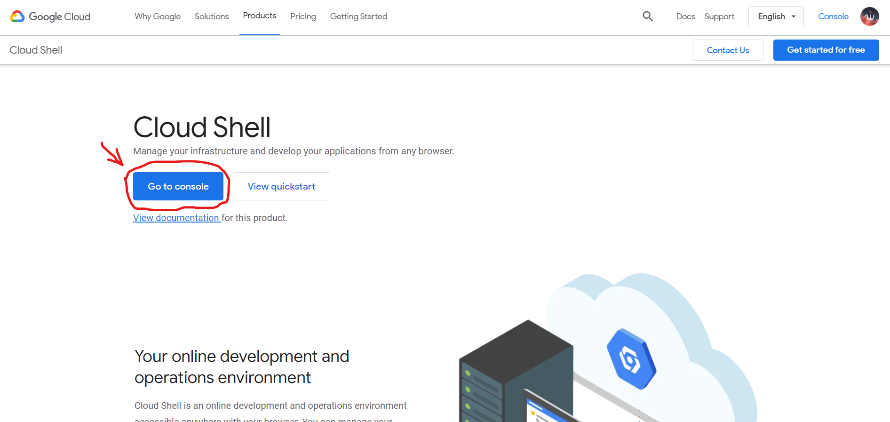
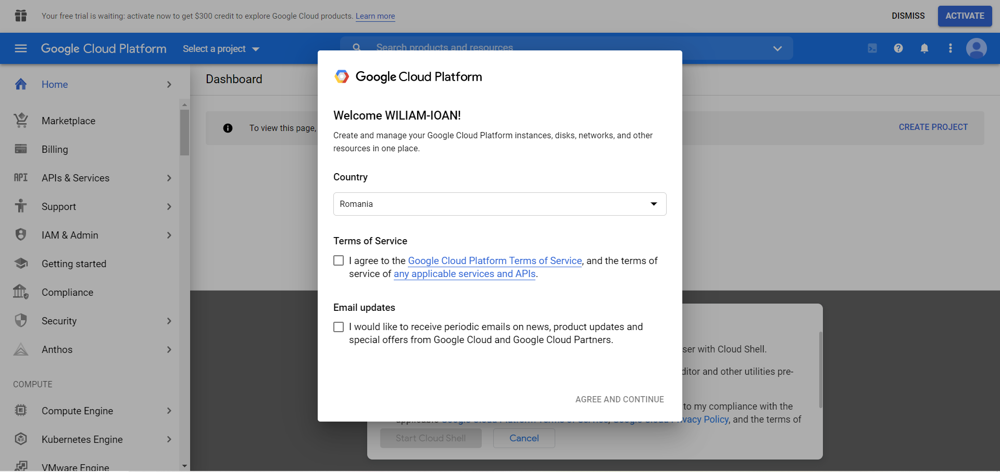
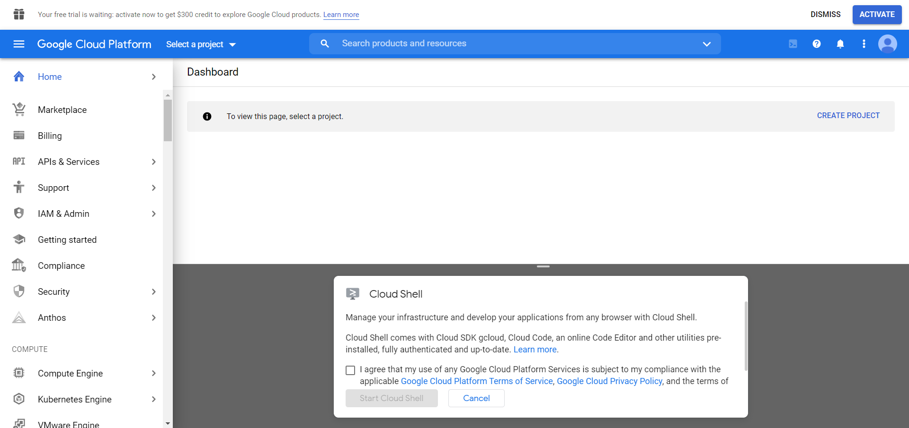
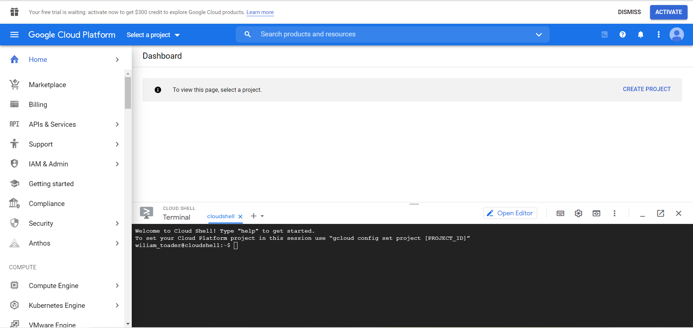
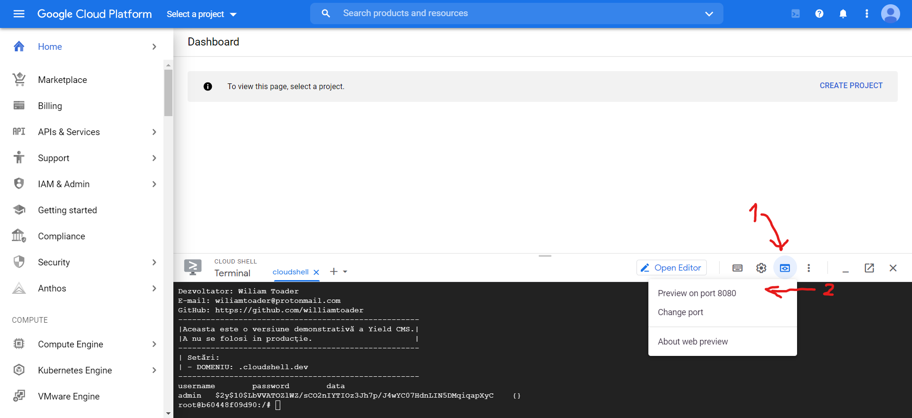
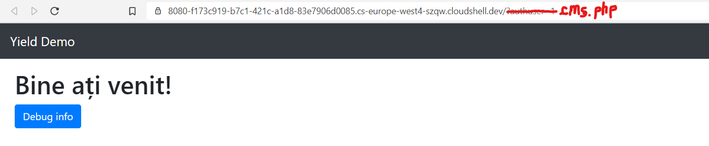
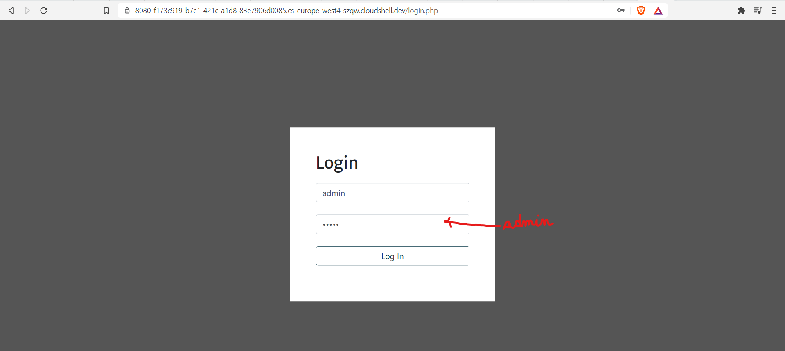
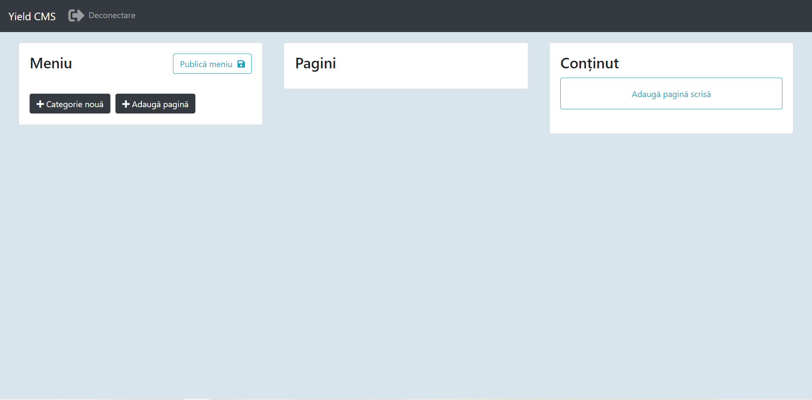
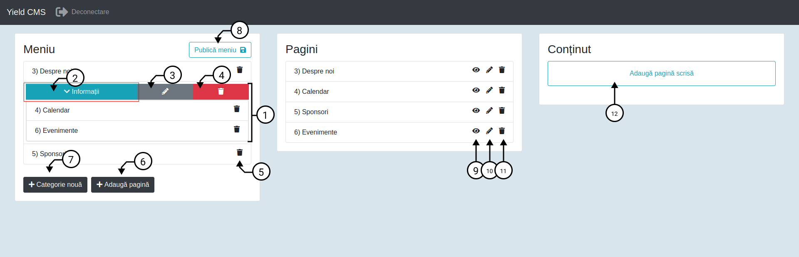
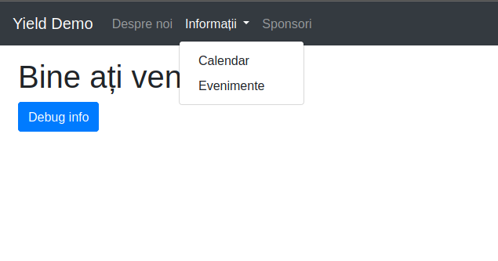

## **Titlul Lucrării:** YieldCMS - Sistem de management al conținutului  
#### PROIECT PENTRU OBŢINEREA ATESTĂRII PROFESIONALE ÎN INFORMATICĂ   
---  

**Nume:** Wiliam-Ioan Toader  
**Clasa:** a XII-a A  
*Colegiul Național „Nicolae Bălcescu”*  
**Profesor coordonator:** Mădalina Nicolae  

---  

### Cuprins  

1. [Introducere](#Introducere)  
2. [Structura aplicației](#Structura-aplicației)  
3. [Detalii tehnice](#Detalii-tehnice)  
4. [Procesul de dezvoltare](#Procesul-de-dezvoltare)   
5. [Prevederi privind instalarea manuală a soluției](#Prevederi-privind-instalarea-manuală-a-soluției)  


# Introducere  
Proiectul are ca scop crearea unei platforme ce poate fi folosită pentru administratea conținutului static de pe un site web. La baza sa se află o interfață web prin care se pot administra individual paginile site-ului cât și structura și ordinea link-urilor din bara de navigație. Crearea/Actualizarea paginilor de tip articol nu necesită editarea manuală a codului sursă, deoarece am integrat in platformă o componentă de editor WYSIWYG [Summernote](https://summernote.org/). Deoarece ansamblul de componente software folosite în acest proiect este unul amplu care necesită configurarea unui server HTTP, a unei baze de date și setarea unor parametri ce țin de conexiune, pentru a demonstra funcționalitatea platformei am dezvoltat o soluție de instalare rapidă pe baza unui container Docker, care acționează precum o mașină virtuală, oferind un mediu similar cu cel al unui sistem de operare, în care am preîncărcat toate componentele software pe care se bazează platforma, ele fiind preconfigurate pentru a oferi o experiență demonstrativă cât mai simplu de pus în funcțiune, urmând să recomand câteva modalități de a rula proiectul.  
  
## Ghid rapid de instalare  
Recomand folosirea uneia din următoarele platforme deoarece acestea oferă gratuit accesul la mașini virtuale găzduite prin intermediul cărora proiectul poate fi instalat cu o singură comandă.  
- Google Cloud Platform Cloudshell  
- Play with Docker  

În cazul în care acestea nu sunt disponibile, pe DVD-ul inclus se va afla o imagine precompilată a sistemului de operare în format container, care poate fi instalată local pe majoritatea distribuțiilor moderne de linux(sau Windows 10 prin intermediul Windows Subsystem for Linux) prin intermediul suitei [Docker Engine](https://docs.docker.com/engine/install/).  
  
### Instalarea pe Google Cloud Platform Cloudshell  
**Se va intra pe adresa** `https://cloud.google.com/shell`  

---  
  
---  
  
---  
  
---  
  
  
---  
  
## Important: Comandă
  
Se va copia comanda  
`docker run -it --env YIELD_DOMAIN=.cloudshell.dev -p 8080:8080 wiliamtoader/yieldcms:demo`  
și se va insera în terminal cu `Shift + Insert` după care se dă `Enter` după care se va aștepta până când vor apărea în terminal liniile din imaginea următoare.
  
---  
  
  
---  
  
---  
  
---  
  

# Structura aplicației  
  
  
  
Așa va arăta meniul  

  
## Legendă  
1. Categorie(grup de pagini): parte structrurală a meniului, permite organizarea în meniuri dropdown a paginilor.
2. Buton extindere/ascundere pentru paginile dintr-o categorie, pentru a nu încărca câmpul vizual al utilizatorului.
3. Editare nume categorie
4. Ștergere categorie
5. Ștergere pagină **din meniu**
6. Adăugare pagină **la meniu**
7. Adăugare categorie nouă
8. Salvare și publicare meniu (Nu uitați să salvați după modificarea acestuia)
9. Previzualizare pagină
10. Editare pagină
11. Ștergere pagină
12. Creează pagină nouă (va deschide editorul de pagini)

# Detalii tehnice  
Aplicația este scrisă în php 7.2, este concepută să ruleze pe siteme de operare de tip linux, folosește o bază de date MariaDB, interfața este realizată cu framework-ul Bootstrap 4, iar pentru pagina de administrare am folosit biblioteca jQuery pentru a adăuga interactivitate, partea client-side fiind realizată în javascript.  

## Resurse de hardware si software  
Cerințe hardware scăzute spre medii, iar cerințele software sunt adresate de imaginea docker care integrează toate programele necesare folosind la bază sistemul de operare Ubuntu 18.04, suita docker poate fi instalată din repozitoriile de pachete aferente distributiei utilizate. Pentru a rula local pachetul voi pune niște instrucțiuni mai jos.

# Procesul de dezvoltare   
Am utilizat două medii de dezvolatare Microsoft Visual Studio Code și JetBrains PHPStorm, proiectul a fost dezvoltat pentru a ajuta la administratea site-ului Olimpiadei Naționale de Biologie 2020, urmănd un proces iterativ de lucru și de testare, prin care am ajuns la versiunea actuală. În această versiune demonstrativă a aplicației am automatizat procesul de configurare a serverului fără a mai fi nevoie ca utilizatorul să introducă manual utilizatorii în baza de date sau să editeze fișiere de configurare.

# Prevederi privind instalarea manuală a soluției  
După ce a fost instalat mediul de virtualizare [Docker Engine](https://docs.docker.com/engine/install/) se va intra cu permisiuni root în terminalul serverului. Pentru a porni instanța demonstrativă Yield comanda este  
`docker run -it --env YIELD_DOMAIN=DOMENIU -p 8080:PORT wiliamtoader/yieldcms:demo` ,
unde in loc de `DOMENIU` se va pune domeniul pe care va rula interfața de administrare iar în loc de `PORT` se va pune portul pe care va rula serverul HTTP, această comandă va descărca Yield de pe registrul de pachete Docker.
Dacă nu se poate instala din registrul de pachete se va folosi fișierul `yield_image.tar` de pe DVD-ul primit în felul următor:  
```
docker load -i cale/catre/yield_image.tar
docker tag bb715d2516d6 yieldcms
docker run -it --env YIELD_DOMAIN=DOMENIU -p 8080:PORT yieldcms:latest
```  
Se va deschide o consolă bash în care se pot modifica fișierele aplicației.  
Serverul se oprește cu comanda exit.  
